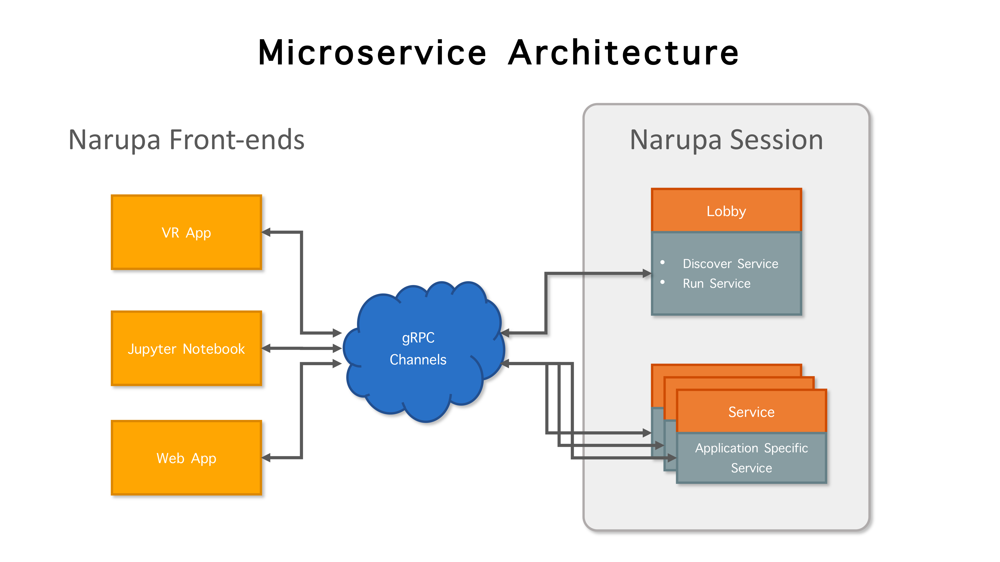

Narupa Architecture
=======================

Narupa is a set of protocols, libraries and programs for performing interactive simulations, with a focus 
on virtual reality (VR). 

At the highest level, Narupa uses a client/server model, in which a frontend application connects
to a server, establishing an interactive session. Simulation data, interactions and controls are transmitted
over the network between the client and server. This means that the server can be running on your desktop, a cluster behind a firewall or on a cloud service,
while multiple frontend applications can connect simultaneously, such as a VR app, smartphone app, or a Jupyter notebook. 

.. image:: assets/narupa_client_server.png 
    :height: 2250px
    :width: 4000px
    :scale: 20%
    :alt: The high-level client server model of Narupa.

Services 
########################

While the client/server model is useful, implementing monolothic client/server applications is not ideal, as it limits the
customisability and extensibility of the framework. Instead, in Narupa we have adopted a microservices architecture, in which 
many modular services communicate, the sum of which produces an application. 

.. note::  The session orchestration via a lobby remains to be implemented, but is recorded here to outline the expected architecture.

A Narupa session represents a collection of these services running together to produce an application experience. Every 
session consists of a lobby, which is the entry point to a session. Client applications can join the lobby, discover what services are available
or running, and join them. 

This architecture makes Narupa very flexible. New features can be added as new services as needed, without cluttering up the main framework. We 
provide a number of service definitions and implementations, including: 

* Trajectory service: Provides trajectories and live simulations (see :doc:`../python/narupa.trajectory.rst`). 
* Interactive molecular dynamics (IMD) service: Exposes methods for applying interactive biasing potentials to a simulation. 

These services are written using `gRPC <https://grpc.io/>`_, a framework for remote procedure calls. 
The key features that make it great for Narupa are:

* High performance, fast communication. 
* Language portable. Clients and servers can be written in many languages, including C#, Python and C++. 
* Built on HTTP2, so includes routing, authentication and security. 

An Example: Interactive Molecular Dynamics
################################################

