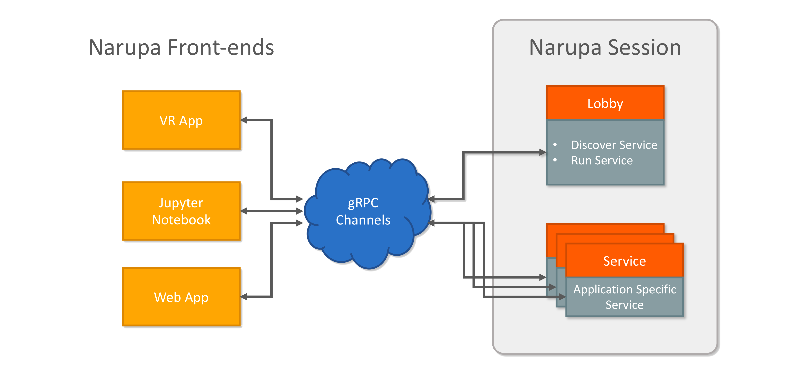
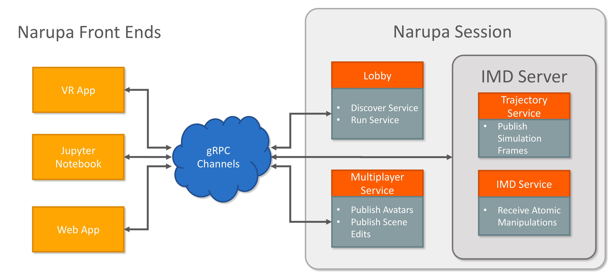
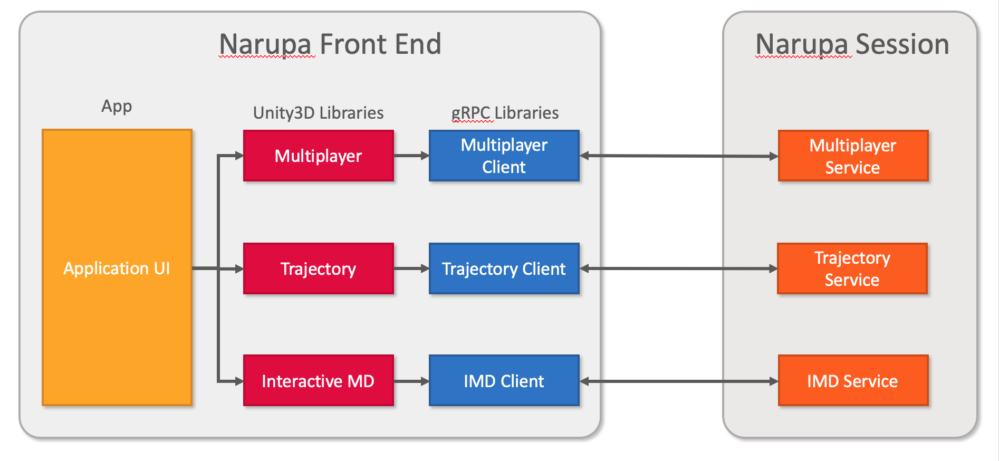

NanoVer Architecture
=======================

NanoVer is a set of protocols, libraries and programs for performing interactive simulations,
with a focus on virtual reality (VR).

At the highest level, NanoVer uses a client/server model, in which a frontend application connects
to a server that runs a simulation in real-time, establishing an interactive session. Simulation data, interactions and controls are transmitted
over the network between the client and server. 
There a several good reasons for using this model:

* Separation of concerns. Keeping the simulation separate from the visualisation 
  makes it easier to customise and add new features. You want to swap out a 
  molecular simulation for a galaxy simulation? Just change the server!
* Scientific software is often written in different programming languages to 
  those that we are best suited for visualisation. For example, most of our 
  molecular dynamics simulations run using python, while our VR application
  is written in C#. 
* The server can be running wherever it is convenient, be it on your desktop, 
  a cluster behind a firewall or on a cloud service, while multiple frontend 
  applications can connect simultaneously, such as a VR app, 
  smartphone app, or a Jupyter notebook. 

.. image:: assets/architecture/narupa_2019_client_server.png 
    :height: 1578px
    :width: 4000px
    :scale: 20%
    :alt: The high-level client server model of NanoVer.

Services 
########################

While the client/server model is useful, implementing monolothic client/server applications is not ideal, as it limits the
customisability and extensibility of the framework. Instead, in NanoVer we have adopted a microservices architecture, in which 
many modular services communicate.

.. note::  The session orchestration via a service hub is currently under development, but is recorded here to outline the architecture.

This architecture makes NanoVer very flexible.
New features can be added as new services as needed, without cluttering up
the main framework.
We provide a number of service definitions and implementations, including:

* :doc:`nanover.trajectory <../../python/nanover.trajectory>`: Provides trajectories and live simulations. 
* :doc:`nanover.imd <../../python/nanover.imd>`: Provides methods for applying interactive biasing potentials to a simulation.
* :doc:`nanover.multiplayer <../../python/nanover.multiplayer>`: Provides synchronisation of avatars and state for multiplayer applications.

The services described above provide the core for the NanoVer iMD application, but the tools
can be used to create custom services for different applications.

These services are written using `gRPC <https://grpc.io/>`_, a framework for remote procedure calls. 
The key features that make it great for NanoVer are:

* High performance, fast communication. 
* Bidirectional streaming. Clients and servers can establish long lived 
  connections and stream data to and from each other flexibly.
* Language portable. Clients and servers can be written in many languages,
  including C#, Python and C++. 
* Built on HTTP2, so includes routing, authentication and security. 

An Example: Interactive Molecular Dynamics
################################################

The canonical NanoVer session is one of interactive molecular dynamics (IMD), where one or more front end applications 
connect to a live simulation that can be visualised and interacted with through biasing potentials. 

Conceptually, the IMD server consists of two services: a trajectory service and an IMD service. The trajectory
service publishes the changes in the simulation to clients, enabling it to be visualised. It also handles 
control of the simulation state, such as pausing or restarting. 
The IMD service, meanwhile, takes care of incoming requests from the client applications to apply biasing potentials
to the simulation. These are applied as forces to the molecular dynamics engine, which in turn integrates them. 

Combined together, the two services are sufficient to visualise and interact with a simulation in real time.
How these services actually talk to MD program that they provide is an implementation detail,
which the protocol does not need to know about.

The trajectory and IMD service are sufficient to produce an application that front end clients
can connect to and visualise.
In the simplest case, the services will run on a particular port on the network,
and a front end can be configured to connect to them. 

However, NanoVer provides additional useful functionality,
such as synchronisation as of avatars in a multiuser environment.
The trajectory and IMD services do not need to concern themselves
with the details of multiplayer,
and so this functionality is implemented in another service, the Multiplayer service. 

Front End Architecture
################################################

As the server side is modular, so too is the front end. The VR front end app, [NanoVer iMD](https://github.com/IRL2/nanover-imd), 
is built using the NanoVer Unity plugin, which provides a set of modules for building NanoVer applications.
There are modules for handling the communication with each service, 
which in turn are used to produce application modules that simplify the development of different 
VR applications. For example, there are modules for handling trajectories and simulations, modules 
for performing multiplayer synchronisation, and of course modules for rendering molecular structures. 

